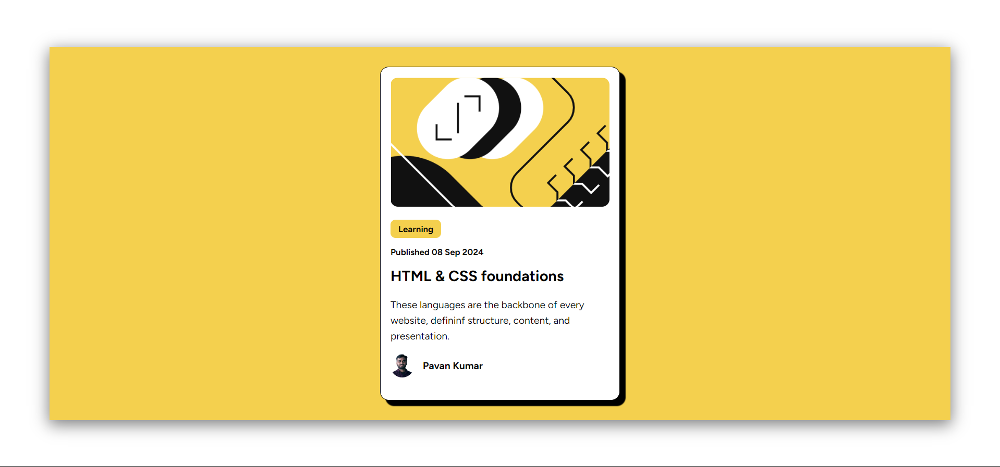
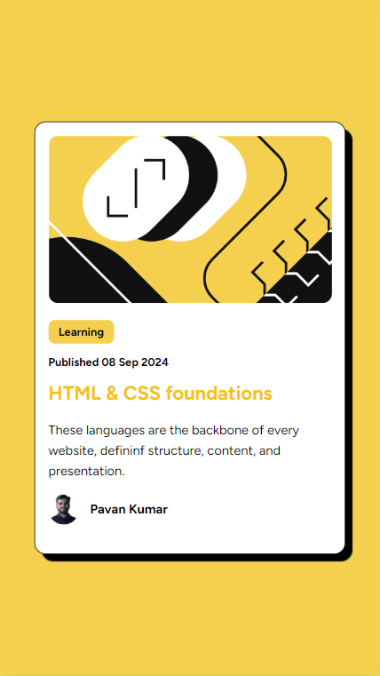
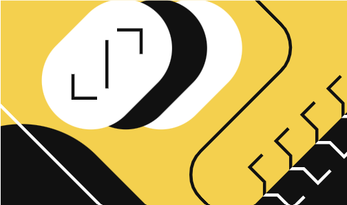

# Blog preview card solution

This is a solution to the [Blog preview card] which i have developed to improve my coding skills by building this projects. i have learnt how make the items center to the page and use the shadows and so on.

## Table of contents

- [Overview](#overview)
  - [The challenge](#the-challenge)
  - [Screenshot](#screenshot)
  - [Links](#links)
- [My process](#my-process)
  - [Built with](#built-with)
  - [What I learned](#what-i-learned)
  - [Continued development](#continued-development)
  - [Useful resources](#useful-resources)
- [Author](#author)
- [Acknowledgments](#acknowledgments)

**Note: Delete this note and update the table of contents based on what sections you keep.**

## Overview

### The challenge

Users should be able to:

- See hover and focus states for all interactive elements on the page

### Screenshot


#### Please find the Screen shot of the desktop Preview



####  Mobile preview 




### Links

- Solution URL: (https://github.com/PavanOther/BlogPreview)
- Live Site URL: (https://pavanother.github.io/BlogPreview/)

## My process

### Built with

- Semantic HTML5 markup
- CSS custom properties
- Flexbox
- CSS Flex
- CSS meadia Quaries

### What I learned

By Building this Project i have learnt the Front end Technoliges HTML Css and how to add the shadows and how to make content to center by unsing the css and 

i Have writtened some media quaries which helped me make the project responsive.


### HTML Code
```html
<!DOCTYPE html>
<html lang="en">
<head>
    <meta charset="UTF-8">
    <meta name="viewport" content="width=device-width, initial-scale=1.0">
    <link rel="stylesheet" href="style.css">
    <title>BlogPreview</title>
</head>
<body>


    <section class="main-container">
        <div class="blog-container">
            <div class=" blog-thumbnail-container">
                
            </div>
            <div class="blog-stats-container">
                <button class="learning">Learning</button>
                <p class="publishing-date">Published 08 Sep 2024 </p>
                <h1 class="blog-title">HTML & CSS foundations</h1>
                <p class="blog-description">These languages are the backbone of every website, defininf structure, content, and presentation.</p>
                <div class="author-container">
                    
                    <p class="author-name">Pavan Kumar</p>
                </div>
            </div>     
        </div>
    </section>

    
</body>
</html>
```

### Please Find the Css Code Below

```css
@import url('https://fonts.googleapis.com/css2?family=Figtree:wght@300..900&display=swap');

*, *::after, ::before
{
    font-family: "Figtree", 'Times New Roman', Times, serif;
    margin: 0;
    padding: 0;

}

body
{
    position: relative;
    background-color: hsl(0, 0, 100%);
    height: 100vh;
}

.main-container
{
    background-color: hsl(47, 88%,63%);
    position: absolute;
    top: 10%;
    bottom: 10%;
    left: 5%;
    right: 5%;

    /* shadow */

    box-shadow: 0 5px 20px 1px rgba(0, 0, 0, 50%);
}

.blog-container
{
    background-color: hsl(0, 0%, 100%);
    width: 280px;
    height: 400px;
    position: absolute;
    top: 0;
    bottom: 0%;
    left: 0%;
    right: 0%;
    margin: auto;
    padding: .8rem;
    border: 1px solid black;
    border-radius: .7rem;
    box-shadow: 7px 7px 1px hsl(0, 0%, 0%);
}
.blog-thumbnail-container
{
    margin-bottom: .8rem;

}

.thumbnail
{
    border-radius: .6rem;
    width: 100%;
}

.learning
{
    background-color: hsl(47, 88%, 63%);
    border: none;
    padding: 5px 10px;
    color: black;
    font-weight: bold;
    border-radius: .4rem;
    font-size: .7rem;
    margin-bottom: 0.7rem;
}

.publishing-date
{
    font-size: .7rem;
    margin-bottom: .8rem;
    font-weight: bold;
}

.blog-title
{
    font-size: 1.2rem;
    margin-bottom: 1rem; 
}
.blog-title:hover
{
    color: hsl(47, 93%, 50%);
    cursor: pointer;
}


.blog-description
{
    font-size: .8rem;
    font-weight: 400;
    line-height: 20px;
    margin-bottom: 0.8rem;
}
.author-container
{
    display: flex;
    align-items: center;
}

.author-profile
{
    width: 30px;
    border-radius: 50%;
    margin-right: .7rem;
}

.author-name
{
    font-weight: bold;
    font-size: .8rem;
}


@media only screen and (max-width:900px)
{
    .main-container
    {
        top: 0;
        right: 0;
        bottom: 0;
        left: 0;
    }
}
```

### Continued development

I wanted continue my development in the frontend technologies like HTML CSS JavaScript and React JS.


## Author


**My Linked in Profile.**
- LinedIn - [Pavan Kumar Bollu ](https://www.linkedin.com/in/pavankumar0211/)


## Acknowledgments

Thanks to everyone who helped me to build this project.
